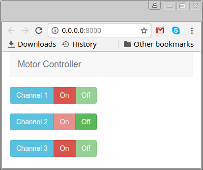

# NanoPi Neo GPIO Demo Project

A simple PHP-based automation project using GPIO on NanoPi Neo

## Prepare

* Install Ubuntu Core
* Install `php5-cli`
* Install `cpufrequtils`
* Append the content of `rc.local` to `/etc/rc.local`

## API Call

`GET /api/[0-9]/[on|off]`

### Example

* `/api/0/on` will turn on load on channel 0
* `/api/1/off` will turn off load on channel 1

> Configure GPIO to channel mapping at `api/index.php:$gpio_config`

## How It Looks

